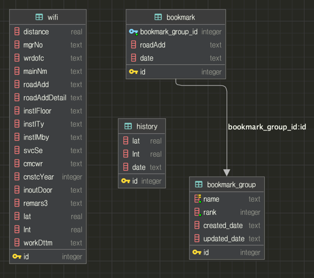

# 서울시 공공데이터 API를 활용한 와이파이 위치 정보 제공 서비스

## 0. 목차

1. [프로젝트 개요](#1.-프로젝트-개요)
3. [기술 스택](#2.-기술-스택)
3. [데이터베이스 구조](#3.-데이터베이스-구조)
4. [기능 설명](#4.기능-설명)

## 1. 프로젝트 개요

스프링을 사용하지 않고 **서블릿**, **JSP로** 구현한 프로젝트를 경험하기 위해 진행한 프로젝트입니다.

## 2. 기술 스택

- 기본 환경

| 언어      | 버전  |
|---------|-----|
| Java    | 1.8 |
| Servlet | 4.1 |
| Tomcat  | 9.0 |

- 데이터베이스 관련

| 데이터베이스 | 버전       |
|--------|----------|
| SQLite | 3.43.0.0 |

- 라이브러리

| 라이브러리              | 버전       | 설명                                              |
|--------------------|----------|-------------------------------------------------|
| OkHttp             | 4.9.3    | HTTP 통신 라이브러리                                   |
| lombok             | 1.18.24  | getter, setter 등의 반복적인 코드를 어노테이션으로 대체           |
| sqlite-jdbc        | 3.43.0.0 | SQLite를 사용하기 위한 JDBC 라이브러리                      |
| jackson-dataformat | 2.12.3   | JSON 데이터를 자바 객체로 변환하기 위한 라이브러리                  |
| jstl               | 1.2      | JSP에서 자바 코드를 사용하지 않고도 반복문, 조건문 등을 사용하기 위한 라이브러리 |
| slf4j              | 1.7.25   | 로깅 라이브러리                                        |
| logback            | 1.2.9    | 로깅 라이브러리                                        |

## 3. 데이터베이스 구조

## 4. 기능 설명

1. 와이파이 정보 가져오기

        - 서울시 공공데이터 API를 사용하여 와이파이 정보를 가져옵니다.
        - 가져온 데이터는 SQLite 데이터베이스에 저장됩니다.
2. 근처 와이파이 정보 가져오기

        - 사용자의 현재 위치를 기반으로 근처 와이파이 정보를 가져옵니다.
        - 사용자의 현재 위치는 HTML5의 Geolocation API를 사용하여 가져옵니다.
3. 북마크 기능

        - 북마크 그룹을 등록하여, 조회한 와이파이 정보를 북마크 그룹에 추가할 수 있습니다. 
4. 북마크 관리

        - 북마크를 등록, 삭제할 수 있습니다.
        - 북마크 그룹을 등록, 수정, 삭제할 수 있습니다.